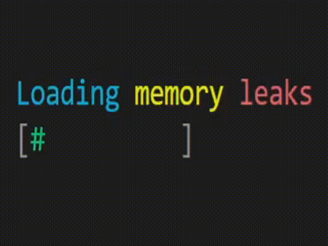

# cpp-lib

A collection of useful C++ functionality not included in the STL.

- No third party dependencies, only the STL is needed
- Designed with C++20 in mind, although many modules are compatible with earlier standards
- Super easy to add modules to any project, just copy the files needed

Modules:
- [arr2d](#arr2d)
- [cstr](#cstr)
- [lengthof](#lengthof)
- [logger](#logger)
- [pgm8](#pgm8)
- [regexglob](#regexglob)
- [term](#term)
- [test](#test)

## arr2d

Contains functions for working with 2D arrays which are allocated as a single contiguous block.

### Files needed
- [arr2d.hpp](include/arr2d.hpp)

### Example

```cpp
int main() {
  int const width = 3, height = 3;
  int arr[width * height] {
    0, 1, 2,
    3, 4, 5,
    6, 7, 8
  };

  arr[arr2d::get_1d_idx(width, 1, 1)] *= 10;
  arr2d::max(arr, width, height); // 40

  int arr2[width * height] {
    0, 1, 2,
    3, 40, 5,
    6, 7, 8
  };

  arr2d::cmp(arr, arr2, width, height); // true

  int arr3[width * height] {
    0, 0, 0,
    0, 0, 0,
    0, 0, 0
  };

  arr2d::is_homogenous(arr, width, height);   // false
  arr2d::is_homogenous(arr2, width, height);  // false
  arr2d::is_homogenous(arr3, width, height);  // true
}
```

## cstr

Contains constexpr versions of `<cstring>` functions, with some additions. See [testing/cstr-tests.hpp](testing/cstr-tests.hpp) for usage examples.

### Files needed
- [cstr.hpp](include/cstr.hpp)

## lengthof

Helper function for getting the size of a static (stack-allocated) C-style array at compile time.

### Files needed
- [lengthof.hpp](include/lengthof.hpp)

### Example

```cpp
int main() {
  int arr[] { 1, 2, 3, 4, 5 }; // 5 elements

  auto const lambda = [](int *a, size_t const len){
    for (size_t i = 0; i < len; ++i) {
      // do something with each element
    }
  }

  // BAD:
  lambda(arr, 5);
  // if `arr` changes and we forget to update the `5`, this code breaks

  // GOOD:
  lambda(arr, lengthof(arr));
  // `lengthof` returns the correct size at compile time,
  // so even if `arr` changes this code won't break
}
```

## logger

Simple, threadsafe logging module.

### Files needed
- [logger.hpp](include/logger.hpp)
- [logger.cpp](impl/logger.cpp)

### Example

```cpp
int main() {
  logger::set_out_pathname("mylogs.log"); // write logs to this file
  logger::set_delim("\r\n"); // I want CRLFs, default is \n
  logger::set_autoflush(false);

  logger::write(logger::EventType::INF, "program started successfully");
  // no flush, so this event gets buffered

  try {
    // do something useful
  } catch (char const *const err) {
    logger::write(logger::EventType::FTL, "uh oh... %s", err);
    logger::flush();
    return 1;
  }

  logger::write(logger::EventType::INF, "program finished successfully");
  logger::flush();

  return 0;
}
```

## pgm8

Module for functions for reading, writing, encoding, and decoding 8-bit PGM images. Requires [arr2d](#arr2d).

### Files needed
- [arr2d.hpp](include/arr2d.hpp)
- [pgm8.hpp](include/pgm8.hpp)
- [pgm8.cpp](impl/pgm8.cpp)

### Example

```cpp
int main() {
  uint16_t const linesWidth = 8, linesHeight = 6;
  uint8_t const lines[linesWidth * linesHeight] {
    0, 0, 0, 0, 0, 0, 0, 0,
    1, 1, 1, 1, 1, 1, 1, 1,
    0, 0, 0, 0, 0, 0, 0, 0,
    1, 1, 1, 1, 1, 1, 1, 1,
    0, 0, 0, 0, 0, 0, 0, 0,
    1, 1, 1, 1, 1, 1, 1, 1,
  };

  // write regular (plain) PGM file
  {
    std::ofstream outFile("lines.pgm");
    pgm8::write_uncompressed(
      outFile,
      linesWidth,
      linesHeight,
      1, // maxval
      lines,
      pgm8::Type::PLAIN
    );
  }

  // read our regular PGM file
  {
    std::ifstream inFile("lines.pgm");
    pgm8::Image img(inFile);
    img.width();        // 8
    img.height();       // 6
    img.maxval();       // 1
    img.pixel_count();  // 48
  }
}
```

## regexglob

Module for glob-like file matching using pure regular expressions.

### Files needed
- [regexglob.hpp](include/regexglob.hpp)
- [regexglob.cpp](impl/regexglob.cpp)

### Example

```
root
│  file1.txt
│  file2.txt
|
└───dir1
│   │  file3.txt
│   │
│   └───dir2
│       │  file4.txt
│       │  _file.txt
│
└───dir3
    │  file5.txt
    │  _file.txt
```

```cpp
int main() {
  regexglob::set_preferred_separator('/');

  std::vector<std::filesystem::path> const matches =
    regexglob::fmatch("root", "file[2-5]\\.txt");

  // `matches`:
  //  root/file2.text
  //  root/dir1/file3.txt
  //  root/dir1/dir2/file4.txt
  //  root/dir3/file5.txt
}
```

## term

Module for doing fancy things in the terminal via ANSI escape sequences. Make sure your terminal supports ANSI escape sequences when using this module!

### Files needed
- [term.hpp](include/term.hpp)
- [term.cpp](impl/term.cpp)

### Example



See [term-example.hpp](term-example/src/term-example.cpp) for source code.

## test

A simple, lightweight testing library. See below for a simple introduction, for a more complex example see [here](https://github.com/nluka/cpp-lib/tree/main/test).

### Files needed
- [test.hpp](include/test.hpp)
- [test.cpp](impl/test.cpp)

### Example

```cpp
namespace myfuncs {
  int add(int a, int b) {
    return a + b;
  }
  int subtract(int a, int b) {
    return a - b;
  }
}

int main() {
  test::set_verbose_mode(false);  // set true if you want passing assertions to be printed
  test::set_indent("  ");         // indent printed assertions with 2 spaces
  test::use_stdout(true);         // print output to console, set false if not wanted
  std::atexit([](){
    test::evaluate_suites();
  });

  // optionally, you can register an output file using `test::set_ofstream`

  // with convenience macros:
  {
    SETUP_SUITE_USING(myfuncs::subtract)
    s.assert(CASE(subtract(3, 1) == 2));    // pass!
    s.assert(CASE(subtract(2, 2) == 100));  // fail!
  }
  {
    SETUP_SUITE("misc")
    s.assert(CASE(1 == 1)); // pass!
  }

  // without convenience macros:
  {
    using myfuncs::add;
    test::Suite s("myfuncs::add");

    s.assert("first assertion", add(1, 2) == 3);  // pass!
    s.assert("second assertion", add(3, 4) == 0); // fail!

    // necessary step when not using convenience macros!
    test::register_suite(std::move(s));
  }

  /* OUTPUT:
    myfuncs::subtract (1/2)
      fail: subtract(2, 2) == 100
    misc (1/1)
    myfuncs::add (1/2)
      fail: second assertion
  */
}
```
